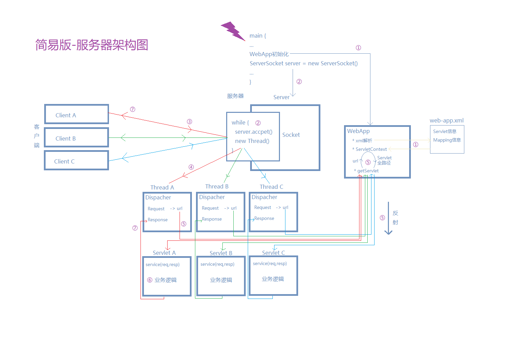

# MyServer
- 为大家提供一个简易版的服务器项目，用于理解Web服务架构
- [GitHub地址](https://github.com/AlionSSS/MyServer)

## Framwork


## Introduction
1. WebApp初始化，创建ServletContext，解析xml文件，将Servlet、Mapping信息存入Context当中
2. 建立ServerSocket，使用while循环接收Socket连接
3. Client发起Socket连接请求，Server接收到消息，为每一个Socket连接开启一个子线程
4. 在每一个Socket对应的线程中，创建Dispatcher，负责解析Request、生成Response
5. 根据解析Request得到的url，从ServletContext中获得对应的Servlet的全包名，并进行反射，生成Servlet实例
6. 不同的Servlet负责不同的业务逻辑处理
7. Servlet业务处理完成后，将消息封装到Response中，最终由Socket连接返回给Client

## Others
- 是否进行动态部署：可以考虑修改web.xml的加载机制
- 提高响应速度：可以在解析xml时，就创建好所有Servlet实例，但是会增加内存消耗
- 限制响应连接数、提高线程并发性能：可以考虑将new Thread改为由线程池创建

## LICENSE
```
Copyright 2018 ALion

Licensed under the Apache License, Version 2.0 (the "License");
you may not use this file except in compliance with the License.
You may obtain a copy of the License at

	http://www.apache.org/licenses/LICENSE-2.0

Unless required by applicable law or agreed to in writing, software
distributed under the License is distributed on an "AS IS" BASIS,
WITHOUT WARRANTIES OR CONDITIONS OF ANY KIND, either express or implied.
See the License for the specific language governing permissions and
limitations under the License.
```
